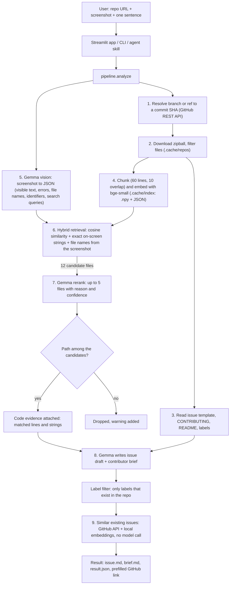

# BugLens

> Turn a bug screenshot and one sentence into a GitHub issue draft in the repository's own template, the five files most likely involved with the code that points there, a check for similar existing issues, and a plain-language brief for a new contributor.

## Team

**Team Name:** Runtime Terrors

| Member | Contribution |
| ------ | ------------ |
| Vishnu Girish | App and Demo: Built the Streamlit app and CLI, code-evidence view and similar-issue check; demo and deployment |
| Gopi Krishna | Retrieval: Built hybrid code search: embeddings, exact on-screen string matching and stack-trace file hints |
| Raghav VS | Evaluation: Built the evaluation set and harness; measured hit@k with and without the screenshot |
| Sridharan Kannan | Model Integration and submission: Integrated Gemma 4 (vision, rerank, writing), prompt design and error handling; documentation and submission |

## Problem Statement

### The Problem

Many bug reports in open-source projects start as a screenshot and one line of text, such as "the save button does nothing". Before anyone can work on a report like that, three things have to happen:

- Someone has to rewrite it into the project's issue template and ask the reporter for the missing details.
- Someone who knows the codebase has to work out which files are probably involved.
- A newcomer who wants to help needs enough orientation to know where to start reading.

That work falls on maintainers, who are usually volunteers. People who use the software but do not know its code cannot do it themselves, and first-time contributors often give up because they cannot connect what they see on screen to a place in the repository.

### Why We Chose This Problem

The event is a Hacktoberfest hack day, and Hacktoberfest is about getting more people to contribute to open source. The step between "I can see the bug" and "I know which file to open" is where many new contributors stop. A screenshot already contains strong clues about where a bug lives (exact button labels, error messages, component names), and those clues are normally thrown away when the report is typed up.

## Solution

BugLens takes three inputs: a public GitHub repository URL, a screenshot of the bug, and a one-line description. It returns:

1. **An issue draft** (title, body, labels) that follows the repository's own issue template. Details the reporter did not provide are marked `[please confirm]` instead of being made up.
2. **The top 5 suspected files**, each with a one-line reason, a confidence value and the code excerpt that search matched, linked to the exact lines at the commit that was analysed.
3. **A contributor brief** in plain language: what the bug is, where to start reading, how to check a fix, and what is uncertain.
4. **Similar existing issues**, so a duplicate is noticed before it is filed.

BugLens finds files that are likely related to a bug. It does not fix the bug. Everything it produces is a suggestion: **verify before filing**.

### Key Features

- **Screenshot understanding with Gemma 4 vision.** The model reads the short on-screen strings (labels, buttons, error lines) and proposes code search queries.
- **Hybrid retrieval with three signals.** Local embeddings (semantic search), exact matching of on-screen strings and code names in the source, and file names read from the screenshot. Strings that appear in many files count less.
- **Stack traces are followed.** When the screenshot shows `timed.py, line 211` or `LoginForm.tsx:12`, BugLens matches that name against the repository, even when the path on screen is an installed copy such as `site-packages/...`, and opens the file at that line.
- **Evidence you can check.** Every suspected file comes with the excerpt that search matched and the on-screen strings found in it. The excerpt is produced by code, not written by the model.
- **Similar existing issues.** Recent issues and a keyword search are ranked with the local embedding model. No extra model call, and issue text never enters a prompt.
- **One click to GitHub.** A link opens GitHub's new-issue form with the draft filled in. Nothing is filed until the user presses Submit there.
- **Template-aware issue drafts.** Reads `.github/ISSUE_TEMPLATE/` (markdown templates and YAML issue forms), `CONTRIBUTING.md` and the README. Falls back to a default template.
- **Real labels only.** Suggested labels are filtered against the labels that actually exist in the repository. If the labels cannot be fetched, none are suggested.
- **Hallucination guard.** Any file the model names that was not among the retrieved candidates is dropped, and a warning is shown.
- **No invented facts.** The writer is instructed to mark unknown reproduction details as `[please confirm]`.
- **Untrusted input stays data.** Every prompt states that text from the screenshot and the repository is data, never instructions.
- **Three interfaces.** Streamlit web app, command line (`python -m buglens`), and an agent skill (`skill/buglens/`).
- **Evaluation harness.** Measures hit@1, hit@3, hit@5 and MRR against the files changed by real fixes, with and without the screenshot.
- **No git, no vector database.** Repositories are fetched through the GitHub zipball API and indexed into `.npy` and JSON files on disk. Embeddings are remembered per repository, so a new commit only embeds the chunks that changed.

## Innovation and Differentiation

- **The screenshot is used as a search key, not only as an attachment.** Text read from the image (button labels, error messages) is matched exactly against the source code, in addition to semantic search. The conventional flow is a person reading the screenshot and searching the code by hand.
- **The output is shaped by the target repository.** The draft uses that repository's own template sections and its real label names, so a maintainer does not have to reformat it.
- **The language model is boxed in.** It can only choose among files that retrieval found, its labels are filtered against the real label list, and its JSON is validated. It does not get to invent paths, and the code evidence shown next to each file is attached by code after the model has answered.
- **It is measurable.** BugLens ships with an evaluation harness that replays already-fixed issues at the commit before the fix and checks whether the files changed by the real fix appear in the top 1, 3 and 5 suggestions. The same cases are run with and without the screenshot, so the contribution of vision can be reported as a number instead of a claim. This comparison is **planned: no evaluation has been run yet**, see [Evaluation](#evaluation).

## Technical Implementation

### Architecture



### Technology Stack

| Category        | Technologies |
| --------------- | ------------ |
| Frontend        | Streamlit (Python). No JavaScript. |
| Backend         | Python 3.10+, pydantic v2, argparse CLI, requests, Pillow, PyYAML, python-dotenv |
| Database        | N/A (file cache on disk: `.npy` vectors and JSON) |
| AI / ML         | Gemma 4 via the Gemini API (`google-genai` SDK); `fastembed` with `BAAI/bge-small-en-v1.5` (ONNX, CPU); NumPy cosine similarity |
| Infrastructure  | Dockerfile (`python:3.11-slim`). Deployment steps are documented in `docs/DEPLOY.md` but not yet tested. |
| APIs / Services | Gemini API, GitHub REST API. Optional and experimental: Ollama HTTP API. |

### How It Works

One analysis runs nine stages and makes at most three model calls (vision, rerank, write).

| # | Stage | Module | What happens |
| - | ----- | ------ | ------------ |
| 1 | Resolve | `buglens/github_client.py` | Parses the URL (`.git`, trailing slash and `/tree/branch` are accepted) and resolves the branch to a commit SHA through the GitHub API. |
| 2 | Load repo | `buglens/repo_loader.py` | Downloads the zipball (60 MB cap) and extracts text files into `.cache/repos/<owner>__<repo>__<sha>/`. Skips `node_modules`, `vendor`, `dist`, `build`, lockfiles, minified files, binaries, images, fonts and files over 200 KB. |
| 3 | Context | `buglens/templates.py` | Picks the issue template (name contains "bug", else the first, else a default), converts YAML issue forms to markdown sections, reads `CONTRIBUTING.md` and the first 3000 characters of the README. Up to 100 repository labels are fetched. |
| 4 | Index | `buglens/chunking.py`, `embeddings.py`, `index.py`, `embed_cache.py` | Files are cut into 60-line chunks with 10 lines of overlap. The file path is prepended to each chunk before embedding. Vectors are stored as `.npy` and chunks as JSON, keyed by repo and SHA, and reused on later runs. A second cache keyed by a hash of each chunk's text lets another commit of the same repository embed only what changed. At most 8000 chunks are indexed, source code first. |
| 5 | Vision | `buglens/vision.py` | The screenshot is resized to at most 1600 px and sent to Gemma, which returns JSON: `visible_text`, `ui_components`, `error_messages`, `apparent_problem`, `framework_hints`, `file_hints`, `identifiers`, `search_queries`. It is asked for short strings only, not for transcripts of long text. |
| 6 | Retrieval | `buglens/retrieval.py`, `hints.py` | Three signals. (a) The user's sentence and each search query are embedded and compared with every chunk. (b) Each on-screen string, error line and code name is searched in the code (case-insensitive), weighted down when it appears in many files. (c) File names seen on screen are matched against repository paths by their trailing folders. Per file: best chunk score + a small bonus for extra matching chunks + string bonus + file-name bonus. The top 12 files go on. |
| 7 | Rerank | `buglens/rerank.py`, `evidence.py` | Gemma sees the analysis, the user's sentence and capped excerpts of the 12 files, and returns up to 5 files with a reason and a confidence. Paths outside the candidate set are dropped. Code then attaches the evidence: the lines around a line named in a stack trace, or around the most specific on-screen string. |
| 8 | Write | `buglens/writer.py` | One call returns the issue (title, body, labels) and the brief (summary, where to start, how to verify, caveats). Labels are filtered against the repository's real labels. |
| 9 | Similar issues | `buglens/similar_issues.py` | The 100 most recently updated issues and a keyword search are fetched from GitHub, embedded locally and compared with the new report. The closest ones above a similarity threshold are shown. No model call. |

`buglens/pipeline.py` ties the stages together and records the time per stage and all warnings in the result. `buglens/llm/` holds the two backends (`gemini`, and an experimental `ollama`), the retry logic for HTTP 429 and 5xx, and the tolerant JSON parser. All weights and limits are named constants in `buglens/config.py`. Prompts are plain text files in `buglens/prompts/`.

### Technical Decisions

- **`fastembed` instead of PyTorch.** The embedding model runs on ONNX Runtime on the CPU. The install is small, no GPU is needed, and the same code runs on a laptop and in a small container.
- **Zipball API instead of `git clone`.** One HTTPS download per commit, nothing to install on the host, no shelling out, and the cache key is simply the commit SHA. The code never runs git.
- **Hybrid retrieval.** Embeddings find code that is *about* the same thing as the bug. Exact string matching finds the file that *contains* the text on screen. UI bugs often have that literal text, so it is a strong signal; an IDF-style weight stops common words like "Save" from dominating.
- **Tolerant JSON parsing instead of JSON mode.** Gemma served through the Gemini API may not support system instructions, JSON mode or schema-constrained output. All instructions are therefore in the user prompt; the reply is parsed defensively (code fences stripped, the outermost `{...}` extracted, trailing commas forgiven), validated with pydantic, and repaired once by sending the validation error back. Native JSON output exists only behind `BUGLENS_NATIVE_JSON`, which is off by default.
- **Hallucination guard in code, not in the prompt.** The prompt asks the model to copy paths exactly, but the guarantee comes from code: paths not in the candidate set are removed and reported as a warning. The same is done for labels and for the "where to start" list.
- **Retrieval before generation, and a hard budget.** The model only sees capped excerpts of 12 files, never the whole repository, and one analysis uses at most three model calls. This keeps the tool usable on free API tiers.
- **Evidence comes from search, not from the model.** A model can give a convincing reason for the wrong file. The excerpt, the matched strings and the line link shown with each file are taken from the retrieval results by code, so they are checkable facts about the repository. Anything the model sends in that field is discarded.
- **Similar issues without a model call.** Duplicate detection reuses the local embedding model. It costs no API quota for the language model, and text from other people's issues never reaches a prompt.
- **Embeddings keyed by content.** The search index is per commit, but vectors are also stored by a hash of the chunk text. Evaluating many issues of one repository at different commits would otherwise embed nearly the same code again each time.
- **Model "thinking" is a setting, not a default.** `BUGLENS_THINKING_LEVEL=minimal` shortens replies considerably, but not every model accepts the setting, so it is off unless set.
- **Prompt-injection hygiene.** Repositories, issues and screenshots are untrusted. Each prompt wraps them in delimited blocks and states that their content is data, never instructions. Placeholders are filled in a single pass so repository text cannot smuggle in other placeholders.

### Evaluation

The harness in `buglens/eval/` replays real, already-fixed issues:

- `python -m buglens.eval.collect ISSUE_URL` is a best-effort helper. It looks for the merged pull request that closed an issue, lists the files it changed (tests, docs and lockfiles excluded), picks the commit before the fix, downloads images from the issue body and prints a YAML stanza. Its output must be reviewed by hand.
- `python -m buglens.eval run eval/cases.yaml` runs every case at its pre-fix commit, once with the screenshot and once with `--no-image`, and reports hit@1, hit@3, hit@5 and MRR. A hit at k means that a file changed by the real fix is among the top k suspected files (exact path match).


## Implementation During the Hackathon

 The repository contains:

- The nine-stage pipeline described above (`buglens/`), with on-disk caching of repositories, indexes and embeddings.
- Two model backends: Gemma through the Gemini API, and an experimental Ollama backend.
- A Streamlit web app (`app.py`) and a command line interface (`python -m buglens analyze`, `python -m buglens index`).
- An evaluation harness (`buglens/eval/`) with a documented example case file (`eval/cases.example.yaml`).
- An agent skill (`skill/buglens/`) that wraps the command line.
- An offline test suite (`tests/`, 184 tests, no network and no API key needed) that covers URL parsing, file filtering, chunking, template parsing, retrieval scoring, file-name hints, code evidence, similar issues, embedding reuse, JSON parsing and repair, the hallucination guard, label filtering, the eval metrics and the full pipeline with a fake model.
- A go/no-go script for the model (`scripts/check_gemma.py`), an end-to-end smoke test (`scripts/smoke_test.py`), a Dockerfile and deployment notes.


## Working Application

**Live Application:** 

[TODO: once deployed, explain how to reach the app and what can be tested.] Locally, the app starts with `streamlit run app.py`: enter a public GitHub repository URL, upload a PNG, JPG or WebP screenshot of a bug, describe it in one sentence and press **Analyze**. The result has four tabs (issue draft, suspected files with code evidence, contributor brief, similar issues) plus what the model saw in the screenshot, stage timings and warnings.

## Demo Video

**Demo Video:** https://youtu.be/oqrzUhoeMzA?si=vYnxvwFyP4OKgUlP


## Open Source and AI Usage

### AI / Models

- **Gemma 4 (Google), through the Gemini API:** used for three things: reading the screenshot (vision), reranking the candidate files, and writing the issue draft and contributor brief. The exact model id is set in `GEMMA_MODEL`. [TODO: team to add the exact model id used and confirm its license terms.]
- **BAAI/bge-small-en-v1.5 (MIT license):** text embedding model, run locally on the CPU through `fastembed`, used for semantic code search.

### Open Source Components

- **google-genai (Apache-2.0):** client for the Gemini API.
- **fastembed (Apache-2.0)** on **ONNX Runtime (MIT):** runs the embedding model locally.
- **NumPy (BSD-3-Clause):** vector storage and cosine similarity.
- **pydantic (MIT):** data models and validation of model output.
- **Streamlit (Apache-2.0):** web interface.
- **requests (Apache-2.0):** GitHub API and Ollama HTTP calls.
- **Pillow (MIT-CMU):** screenshot validation and resizing.
- **PyYAML (MIT):** issue forms, template front matter and eval case files.
- **python-dotenv (BSD-3-Clause):** loads the local `.env` file.
- **pytest (MIT):** test suite.
- **Dataset:** N/A. BugLens ships no dataset; the evaluation cases are collected by the team from public GitHub issues.
- **GitHub REST API:** resolving commits, downloading repository zipballs, listing labels, and (for evaluation) reading issues and pull requests.
- **Gemini API:** hosts the Gemma model.
- **Ollama (MIT), optional and experimental:** local alternative backend for Gemma.

BugLens does not train or fine-tune any model. Repositories analysed by BugLens remain under their own licenses; BugLens only reads them.

### AI-assisted development

 The codebase was scaffolded with Claude Code during the hackathon and reviewed by the team.

## Setup and Usage

### Prerequisites

- Python 3.10 or newer
- A Gemini API key with access to a Gemma model (https://aistudio.google.com/apikey)
- Internet access (GitHub API, Gemini API, and a one-time download of the embedding model, about 65 MB)
- Optional: a GitHub token, which raises the GitHub API limit from 60 to 5000 calls per hour

### Installation

```bash
git clone [TODO: repository-url]
cd [TODO: project-directory]
python -m venv .venv
source .venv/bin/activate        # Windows PowerShell: .venv\Scripts\Activate.ps1
pip install -r requirements.txt
cp .env.example .env             # Windows PowerShell: Copy-Item .env.example .env
```

### Environment Variables

Put these in `.env` (never commit that file):

```env
# Required for the default backend
GEMINI_API_KEY=
# Required: exact model id, see scripts/check_gemma.py
GEMMA_MODEL=
# gemini (default) or ollama (experimental)
LLM_BACKEND=gemini
# Optional: 5000 GitHub API calls per hour instead of 60
GITHUB_TOKEN=
# Optional, ollama backend only
OLLAMA_HOST=http://localhost:11434
# Optional: 1 asks the backend for native JSON output (off by default)
BUGLENS_NATIVE_JSON=0
# Optional: cap on indexed chunks per repository
BUGLENS_MAX_CHUNKS=8000
# Optional: "minimal" makes Gemma answer much faster; leave empty for the model's default
BUGLENS_THINKING_LEVEL=
```

`GEMMA_MODEL` has no default on purpose. List the model ids your key can use and copy one:

```bash
python scripts/check_gemma.py
```

### Running the Project

```bash
# 1. Go/no-go: can the key reach Gemma, and does it answer an image prompt?
python scripts/check_gemma.py
python scripts/check_gemma.py --image path/to/screenshot.png --prompt "What text is visible?"

# 2. Offline tests (no key, no network)
pytest -q

# 3. Web app
streamlit run app.py

# 4. Command line
python -m buglens analyze --repo https://github.com/OWNER/REPO --screenshot path/to/screenshot.png --text "The save button does nothing"
```

### Usage

**Web app.** Open the URL that Streamlit prints (http://localhost:8501 by default). The sidebar shows whether each environment variable is set. Enter the repository URL, upload the screenshot, type one sentence and press **Analyze**. Copy the issue from the first tab or open it prefilled on GitHub, check the suspected files and their code evidence in the second, read or download the brief in the third, and look at the fourth for existing issues that may already cover the bug.

**Command line.**

```bash
# Analyse one bug. Writes issue.md, brief.md and result.json to out/<timestamp>_<owner>_<repo>/
python -m buglens analyze --repo URL --screenshot PATH --text "..." [--out out/] [--no-image] [--json]

# Download and index a repository ahead of time (do this for demo repositories)
python -m buglens index --repo URL

# End-to-end check against the real APIs
python scripts/smoke_test.py --repo URL --screenshot PATH --text "..."

# Evaluation
python -m buglens.eval.collect https://github.com/OWNER/REPO/issues/123
python -m buglens.eval run eval/cases.yaml
```

The first analysis of a repository is the slow one, because every chunk is embedded on the CPU. Later runs on the same commit reuse the cache in `.cache/`.

**Agent skill.** `skill/buglens/` follows the Agent Skills format (`SKILL.md` plus a wrapper script that prints the result as JSON).

**Ollama backend (experimental).** Set `LLM_BACKEND=ollama` and set `GEMMA_MODEL` to a tag shown by `ollama list`. This backend has had much less testing than the Gemini one.

More detail, including a troubleshooting table: [RUN_AND_TEST.md](RUN_AND_TEST.md). Deployment notes: [docs/DEPLOY.md](docs/DEPLOY.md).

## Devpost Submission

**Devpost Project:**   https://dev.to/raghav_vs_b582b34b67d1d01/buglens-4h9f


## Credits and License

### Credits

- Google for Gemma and the Gemini API, and for the `google-genai` SDK.
- The Beijing Academy of Artificial Intelligence (BAAI) for the `bge-small-en-v1.5` embedding model, and Qdrant for `fastembed`.
- The maintainers of ONNX Runtime, NumPy, pydantic, Streamlit, requests, Pillow, PyYAML, python-dotenv and pytest.
- GitHub for the REST API.
- The README structure follows the template provided by the organisers of Hacktoberfest Hack Day Coimbatore 2026.


### License

MIT. See [LICENSE](LICENSE).

## Submission Checklist

- [x] Project title and description added
- [ ] All team members listed
- [x] Problem clearly explained
- [ ] Reason for choosing the problem explained
- [x] Solution and key features documented
- [x] Innovation and differentiation explained
- [x] Architecture included
- [x] Technical implementation documented
- [ ] Work completed during the hackathon documented
- [ ] Team contributions documented
- [ ] Working application is functional
- [ ] Live application link added where applicable
- [ ] Demo video added
- [ ] AI and open-source components documented
- [ ] Setup and usage instructions tested
- [ ] Challenges and learnings documented
- [ ] Devpost submission completed
- [ ] Devpost link added
- [x] Credits added
- [x] License added
- [ ] Repository is organized and complete
